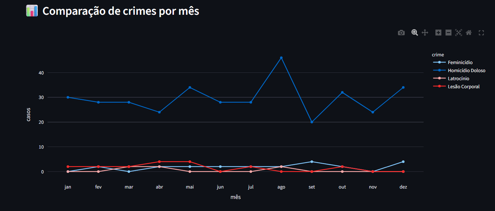
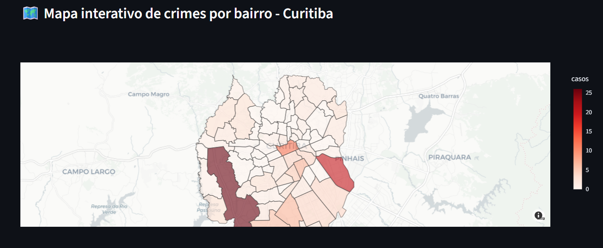

# 📊 Análise de Homicídios em Curitiba — Dashboard Interativo

<p align="center">
  
</p>

---

## 📝 Descrição do Projeto
Este projeto tem como objetivo **analisar os homicídios no município de Curitiba**, utilizando um **dashboard interativo** construído com **[Streamlit](https://streamlit.io/)** e **[Plotly Express](https://plotly.com/python/plotly-express/)**.  

O sistema permite **filtrar, visualizar e analisar dados** sobre diferentes tipos de homicídios, apresentando **KPIs, mapas de calor e gráficos dinâmicos** para facilitar a interpretação das informações.

---

## 🎯 Objetivo do Projeto
Levantar uma análise completa dos **homicídios registrados na cidade de Curitiba**, com base nos dados fornecidos, permitindo que os usuários:  

- Visualizem a evolução dos homicídios ao longo do tempo.
- Realizem **filtros personalizados** para análise por tipo, local, data, etc.
- Obtenham **insights rápidos** por meio de **KPIs automáticos**.
- Gerem **gráficos interativos** para auxiliar na tomada de decisões.

---

## 🎥 Demonstração do Projeto

> **📌 Dica**: Suba prints ou GIFs para mostrar o dashboard em funcionamento.  
Substitua os links abaixo pelos seus arquivos/imagens.

<p align="center">
  
</p>

<p align="center">
  
</p>

---

## 🛠️ Tecnologias Utilizadas

| Ferramenta     | Descrição                               |
|---------------|-----------------------------------------|
| **Python**    | Linguagem principal do projeto          |
| **Streamlit** | Framework para criação de dashboards    |
| **Pandas**    | Manipulação e análise de dados          |
| **Plotly**    | Criação de gráficos interativos         |
| **Pathlib**   | Manipulação de arquivos e diretórios    |
| **Regex (re)**| Padronização e limpeza de colunas       |

---

## 📂 Estrutura do Projeto

├── 📁 dados
│ ├── Corporal.csv
│ ├── Doloso.csv
│ ├── Feminicidio.csv
│ ├── Latrocinio.csv
├── projetoharve_fixed.py # Código principal do dashboard
├── requirements.txt # Dependências do projeto
├── README.md # Documentação do projeto

## 🚀 Como Rodar o Projeto

### 1️⃣ **Clonar o repositório**
```bash
git clone https://github.com/fdelfino93/violenciacwb